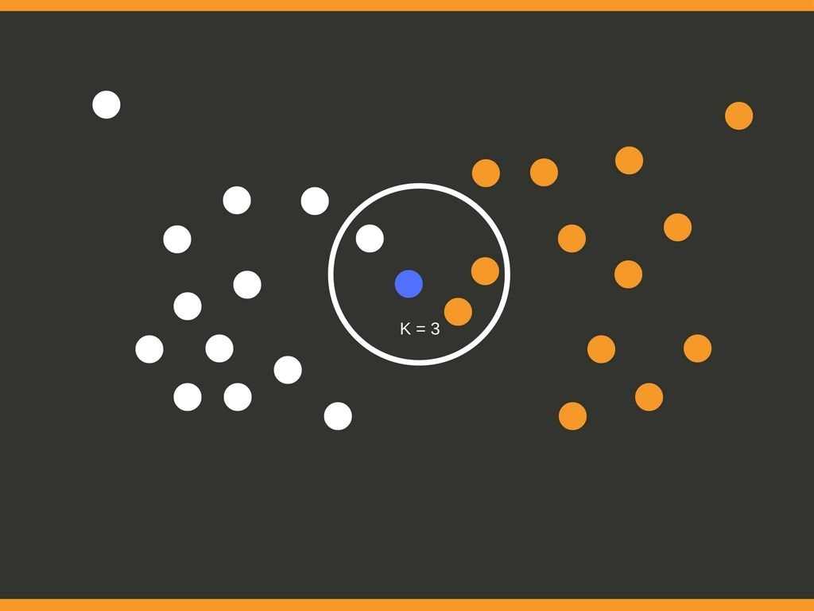

 

# Veri Madenciliği
Iris veri setini sınıflandırma
------------------------------
2018 Ekim

Recep KARADEMİR
____________________________________________________________________________________________________________________________________

Özet:
------------------------------

------------------------------

GİRİŞ
------------------------------

UYGULAMA
------------------------------

------------------------------

------------------------------

___________________________________________________________________________________________________________________________________

İletişim
------------------------------

2015141003@cumhuriyet.edu.tr

recepkarademir0018@gmail.com

www.recepkarademir.com

https://recepkarademir.blogspot.com.tr

https://recepkarademir.wordpress.com
